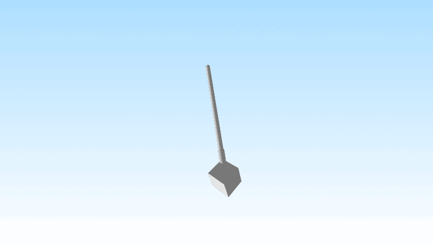

# Phenobox Project
Phenobox project at Parisod's research group University of Fribourg (CH)


## Introduction
This projects aims to create 3D-models of plants of Biscutella laevigata to be able to extract features (e.g., volume) that represent plant fitness. A selection of the features of interest is yet to be defined. 
It will be carried out throughout 5 years, every two weeks each plant is scanned and the raw 3d-models are stored. The post-processing of the models is carried out in a second moment, and the models are kept also in their raw state to be able to peform secondary processes to extract more features from the model in the future.

## Materials
#### Hardware for scanning the plant:
- **Box** (aka phenobox)  
    About 1mx1mx1m frame having black panels on the bottom, back and top, two semitransparent plexiglass panels to the two sides, and one black rubber mat to cover the main aperture.  
    The frame also has a pole placed vertically in the middle of the main entrance to allow the placement of the scanner.
- **Light system**  
    Two wide stripes of dimmerizable LEDs placed on the cieling of the box and covered with a semitransparent film to diffuse the light evenly.
- **Turntable** (from RevoPoint)  
    Electric turntable where to place the pot that connects via bluetooth to RevoScan5 software to control the seconds/turn.
- **Structured light scanner** (*Revopoint MINI*)  
    [Structured light scanner](https://en.wikipedia.org/wiki/Structured-light_3D_scanner)  having a light projector and a camera system. Here's the [specifics](https://www.revopoint3d.com/pages/industry-3d-scanner-mini).
    - Calibration plate  
        Black plastic rectangle with different white dots.
- **Reference cube**
        3D printed blue cube (1.5x1.5x1.5cm) and stick (8.5cm)


  
- **PC** (Lenovo Legion)
    _""characteristics""_

#### Softwares:
- **RevoScan5** (_v5.4.8_)  
    Software used to control the scanning, strictly related to the scanner and turntable.  
    It is also used for the first post-processing steps of the models.
- **Revopoint MINI Calibrator**  
    Software downloaded from a sketchy [drive](https://drive.google.com/file/d/1SiG12cl_BQr5D1KG6iokxiNpssmt3VMq/view?usp=sharing) shared by a [forum](https://forum.revopoint3d.com/t/how-to-calibrate-mini/22819) moderator of Revopoint.  
    Works very well for calibrating the camera, but it is very difficult to carry out a successfull calibration.
- **Visual Studio Code** (_v1.96_)
    [VS code](https://code.visualstudio.com) used to write python (_python v3.11.5_) scripts to extract the features of interest.
- **Blender** (_v4.1_)  
    [Blender](https://www.blender.org/) is a public project hosted on blender.org, licensed as GNU GPL, owned by its contributors. For that reason Blender is Free and Open Source software, forever.  
    Use blender to import the output file from RevoScan5 to calculate its volume by using python scripts.


## Experimental setting
There are about 170 seedlings (some of them might still die before reaching maturity), ((unknown plant subspecies)), growing in the greenhouse.  
There are two main steps that are required to obtain the information needed: scanning of the plant, post-processing of the model to obtain the desired features.

Features that can be captured yet: plant volume, leaf area, leaf length & width.

#### Scanning
1. Open RevoScan5 on PC and enter in a new or existing project folder, connect scanner and turntable to the pc and turn on the lights in the phenobox
2. Connect the platform:
→ Accessory → Dual Axis → Connection → Select REVO → Connect
→ Accessory → Dual Axis → Settings → Set speed to 60 and angle to 0°, then -8° for each plant.
3. Set to "dark" and "color scanning"
4. Adjust with the "Exposure" slider, increasing it to the maximum level
5. Place the pot with the plant and the reference object on the center of the rotor plate and set the position for best scanning, regulating accordingly the camera exposure. Set the turntable speed
6. Adjust the camera height so that the plant is centered, ensuring the gauge shows “+/- good”
7. Start the scanning and after about 800 frames interrupt it
8. Name the file with the plant name and scan angle (-0 or -8)
9. Perform a scan at an angle of -8°

#### Post-processing & features extraction
##### On RevoScan5 (scan processing):
1. Fusion at 0.08 → Apply (Fusion can be performed for all files simultaneously)
2. Isolation (between 0.5% and 4.0%, ensuring that small leaves are not eliminated) → Detect → Apply
3. Overlap (~0.15) → Detect → Apply
4. Merge (Feature) → Select the two files (If merging fails, reverse the order of the selected files)
5. Name the newly created file
6. Mesh → 6.0 → Apply (Mesh can be performed for all files simultaneously)
7. For plant with leaves overlapping the pot: remove the pot and soil manually by encircling them with the right-hand circle tool and deleting. Cut cube stem to limit.
   -> otherwise, see below how to remove pot automatically.
9. Isolation at 1.0% → Detect → Apply
10. Fill holes → Curved → Detect → Select all with Ctrl+A → Apply
11. Export as a mesh model (“ply” format)

##### On Blender (features extraction):
11. Reset the workspace → A → X → Enter
12. Open "experimentv1" and the script [get_measures.py](get_measures.py)
13. Import the file in "ply" format  (File → Import)
14. Select "PlantMeasures"
15. Separate the plant from the cube via "Separate by Loose Parts"
16. Click on the cube → Select "Get Plant Volume" → record the plant’s volume
18. If the leaves are separated from each other and the plant:
    Select on a leaf of interest (a single one) → click on Measure Leaf → record leaf's area, width and length
19. If the leaves are connected to the base of the plant:
    Go back on Revoscan5 → isolate the leaf you're interested in → repeat steps 13-18 of features extraction.
           
#### Pot Removing (for small plants)
The [script](clustering_algo.py) is made to be run on the command line of your terminal. Here's how to do it.

```bash
python clustering_algo.py scans/Merge_01_pc.ply scans/Merge_01_pc_Plant_Filtered.ply --eps 0.6 --min_samples 25
```
- First argument: Your point cloud file (input file)
- Second argument: Processed point cloud file (output file, provide the path!)
- --eps: DBSCAN eps parameter. The maximum distance between two samples for one to be considered as in the neighborhood of the other (Default set to 0.5)
- --min_samples: The number of samples (or total weight) in a neighborhood for a point to be considered as a core point.

#### leaf count
The script [count_leaves_test.py](count_leaves_test.py) is attempting to count the number of leaves of the plant. However, the data is quite noisy and it's still hard to get a good result.


### Additional information
* Calibrate the camera with the “Revo calibration” software at the start of each scan series or every two weeks.
* When the distance between the camera and the plant is too great, the camera cannot reconstruct the plant and may lose tracking.
* When there are stems with flowers, the camera does not scan them, or scans them incorrectly.


## TO DO
- add parameters that we could measure (see parameters list).
